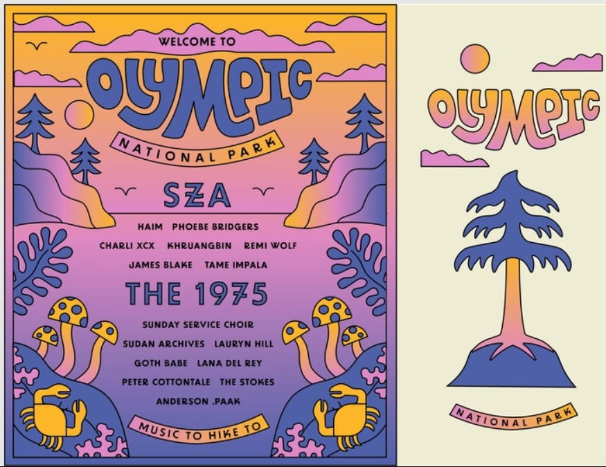

# Event Management and Reservation Web Application

**GetTicket Events** - A comprehensive Django-based platform for event management, ticketing, and reservations.

This Django project aims to develop a web application for the management and online reservation of events, this project caters to three main actors: the administrator, the organizer, and the customer. Each actor has specific functionalities and access levels within the application.

## Technology Stack

### Backend
- **Framework**: Django 4.2.28
- **Python**: 3.12
- **Database**: SQLite3
- **ORM**: Django ORM

### Frontend
- **HTML5/CSS3**: Bootstrap 4
- **JavaScript**: jQuery with custom event handling
- **Rich Text Editor**: CKEditor 6.7.3
- **Location Mapping**: Mapbox Location Field
- **UI Components**: AdminLTE 3, Bootstrap Icons, FontAwesome

### Key Libraries
- **django-crispy-forms** (2.3) - Form styling and layout
- **django-ckeditor** (6.7.3) - Rich text editor for event descriptions
- **django-mapbox-location-field** (2.1.0) - Geolocation support
- **Pillow** (10.3.0) - Image processing
- **pytz** - Timezone handling

### Development
- **Virtual Environment**: Python 3.12 (`.venv312`)
- **Package Manager**: pip
- **Version Control**: Git

## Features

- Multi-actor role-based access control (Admin, Organizer, Customer)
- Event creation, management, and categorization
- Online ticket purchasing and reservation system
- Real-time inventory management
- Payment processing integration
- User profiles and ticket history
- Search and filtering capabilities
- Responsive mobile-friendly design
- Rich text editor for event descriptions
- Location-based event mapping
- User notification and preference management

## Screenshots

### Homepage & Hero Section


### Event Thumbnails
<div style="display:flex; gap:10px; flex-wrap:wrap;">

**Music Events**


**Sports Events**


**Tech Events**


**Arts Events**


</div>

## Actors and Functionalities

### Administrator

The administrator plays a crucial role in overseeing the entire system. They possess the following capabilities:

- **User Management**: The administrator has the authority to manage user accounts, including creating, modifying, and deleting user profiles. They can handle user roles and permissions to ensure proper access control.

- **Event Management**: The administrator has full control over events on the platform. They can add, modify, and remove events as necessary. Additionally, they are responsible for validating events proposed by organizers to maintain quality standards.

- **Events Dashboard**: The administrator can access a comprehensive dashboard that provides an overview of all events on the platform. This dashboard serves as a monitoring tool, allowing the administrator to track key metrics and gain insights into the system's performance.

### Organizer

Organizers are individuals or entities responsible for planning and executing events. They are granted the following functionalities:

- **Add Events**: Organizers can create and add new events to the platform. They provide detailed information about the event, including its title, description, date, time, location, and any additional relevant details.

- **Event Information**: Organizers have access to view and review all the information related to the events they have proposed. This includes the event details, participant lists, ticket sales, and any updates or modifications.

- **Modify Events**: Organizers can make changes to the events they have created, such as updating event details, rescheduling, or making any necessary adjustments.

- **Event Dashboard**: Organizers are provided with a dedicated dashboard that offers an overview of their events. This dashboard allows organizers to track ticket sales, participant registrations, and other event-related metrics.

### Customer

Customers are the users of the application who are interested in discovering and attending events. They have the following functionalities:

- **Event Exploration**: Customers can browse and explore all events available on the platform. They can view event details, including descriptions, dates, times, locations, categories, and other relevant information.

- **Event Search**: Customers have the ability to search for specific events using keywords, categories, or other search criteria. This allows them to find events that align with their interests.

- **Online Ticket Purchase**: Customers can conveniently purchase event tickets online through the application. They can select the desired number of tickets and complete the purchase securely.

- **Profile Management**: Customers can manage their profiles, including updating personal information, adding a profile picture, and modifying preferences to enhance their overall experience.

- **Reservation Management**: Customers have access to a list of their reservations, which provides an overview of the events they have booked tickets for. They can view reservation details, make changes, or cancel reservations if necessary.

- **Notification Management**: Customers can manage their notification preferences, allowing them to receive relevant updates and reminders about upcoming events, ticket availability, or any changes related to their reservations.

## Installation & Setup

### Prerequisites

- Python 3.12+
- pip (Python package manager)
- Virtual environment support
- Git

### Quick Start

1. Clone the repository
   ```bash
   cd GetTicket_Events_Django
   ```

2. Create and activate virtual environment
   ```bash
   python3.12 -m venv .venv312
   source .venv312/bin/activate
   ```

3. Install dependencies
   ```bash
   pip install -r requirements.txt
   ```

4. Run migrations
   ```bash
   cd gestion_even
   python manage.py migrate
   ```

5. Create superuser
   ```bash
   python manage.py createsuperuser
   # Username: red
   # Password: 123456
   ```

6. Seed sample events
   ```bash
   python manage.py shell < ../seed_events.py
   ```

7. Start development server
   ```bash
   python manage.py runserver 0.0.0.0:8000
   ```

8. Access the application
   - Homepage: http://127.0.0.1:8000
   - Admin Panel: http://127.0.0.1:8000/admin

## Image Management

### Image Locations

**Static Images** (User Interface elements):
- Path: `gestion_even/static/img/`
- BG_HERO.jpg - Homepage hero background
- logo.png - Application logo
- add-to-cart.png - Shopping cart icon
- userProfile.png - User profile avatar placeholder
- ev1.jpg, ev2.jpg, ev3.jpg, ev4.jpg - Event thumbnails
- avatar04.png, avatar5.png - User avatar images
- utilisateur.png - Generic user icon
- favicon.png - Browser tab favicon

**Event Images** (User-uploaded promotional content):
- Path: `gestion_even/media/event_image/`
- User-uploaded event promotional images
- Automatically organized by event
- Sample images: event_music.jpg, event_sports.jpg, event_tech.jpg, event_arts.jpg

**Event Category Images**:
- Path: `gestion_even/media/event_category/`
- Category-specific images

### How to Replace Images

**Static Images** (UI elements):
- Replace files directly in `gestion_even/static/img/`
- Recommended formats: PNG (transparent backgrounds), JPG (photos)
- Image size recommendations:
  - Hero background: 1920x1080px or larger
  - Logo: 300x100px
  - Thumbnails: 400x300px
  - Icons: 64x64px

**Event Images** (User uploads):
- Upload through Django admin panel: `http://127.0.0.1:8000/admin/events/event/`
- Or manually place images in `gestion_even/media/event_image/`

**Generate Sample Images**:
```bash
python generate_images.py
```

## Database Models

The application uses the following core models:

- **Event**: Event details, pricing, scheduling, location, description
- **EventCategory**: Event categorization (Music, Sports, Technology, Arts, Business)
- **Ticket**: Ticket types, pricing, and availability tracking
- **EventImage**: Associated event promotional imagery
- **Payments**: Payment records and transaction history
- **EventMember**: User attendance and participation tracking
- **User**: User profiles with role-based access (Admin, Organizer, Customer)
- **EventAgenda**: Event agenda and timeline
- **EventJobCategoryLinking**: Linking events to job categories

